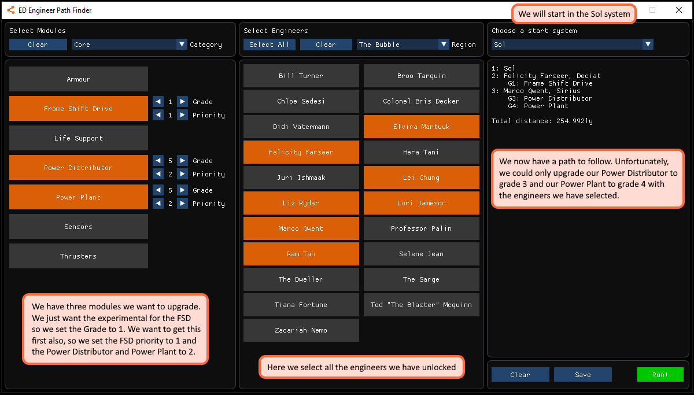

# Elite Dangerous Engineer Path Finder

This app finds the shortest path to through all relevant engineers to upgrade a particular list of modules. I wrote this because I found I with each new ship loadout I was bouncing back and forth across the bubble upgrading each module. I figured there probably exists a shortest path that would take me through all of them that would save me some time.

## Use

 1. Select the system you want to start in. At the moment this is limited to only those which are home to an engineer
 2. Choose the modules you want to upgrade
 3. Select all the engineers you have unlocked
 4. Set engineer priorities. Those with higher priorities will be visited first. Try not to overuse though. This was really only designed to pick out one or two engineers that upgrade critical components, like the FSD and Power Plant. Setting too many priorities will break the underlying routine and will probably not return the shortest path.
 5. Run!
 
## Example

## Background

This is a classic [travelling salesman problem](https://en.wikipedia.org/wiki/Travelling_salesman_problem). I've used a dynamic programming approach, which should give the exact solution. However, the time it take to find the solution grows exponentially with the number of systems. This shouldn't be noticeable with regular use, but for example you select every module and every engineer, it will take a few minutes to find a solution.

For the case where there are multiple choices of engineer when upgrading a particular module (Felicity Farseer and Elvira Martuuk for the FSD for example), both paths are constructed and tested.

## Feedback

Feel free to submit any feedback! If you want to submit an issue, use one of the following tags:

 - **Bug** - crashes, anything that seems broken, output that seems incorrect or doesn't make sense.
   - Example: Selecting bubble engineers still takes me to Colonia.
 - **Enhancment** - features and ideas you would like to see.
   - Example: I want the ability to add my own start and end system.
   
## Credits

[ImGui](https://github.com/ocornut/imgui/): A great immediate GUI library.

[Premake](https://premake.github.io/): For simplifying project file creation

[Glad](https://glad.dav1d.de/): OpenGL loader

[SDL2](https://www.libsdl.org/): Development library for graphics and peripherals

[Armin Zare Zadeh](https://github.com/akzare) for his [c++ solution](https://github.com/akzare/Algorithms/blob/master/src/main/cpp/algorithms/graphtheory/TspDynamicProgrammingIterative.h) to the TSP problem
